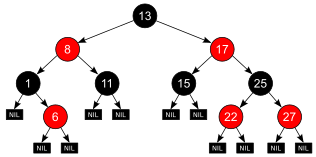

# Red Black Tree 
   

## Features
There were implemented: 
- *add* a number
- *find* a number
- *height* of the tree
- all of the *rotations* needed (leftRotate, rightRotate, leftRightRotate, RightLeftRotate)
- Finding the *successor* and *predecesor* of a number in the Tree
- removing a number (Unstable for large Trees)

## How does it work

In the Header_files there are 2 classes : Node and RedBlackTree along with all the functions needed for the tree : 
```cpp

private:
    //rotations:
    void leftRotate(Node* node);
    void rightRotate(Node* node);
    Node* leftRightRotate(Node* node); //returns the one in the top
    Node* rightLeftRotate(Node* node); //returns the one in the top
    void rotate(Node* node); 
    //-----------------

    //checking:

    //1.Rules verified below:
    //2.Each tree node is colored either red or black.
    //3.The root node of the tree is always black.
    //4.Every path from the root to any of the leaf nodes must have the same number of black nodes.
    //5.No two red nodes can be adjacent, i.e., a red node cannot be the parent or the child of another red node.
    //6.Null nodes are black

    void checkColor(Node* node); //verify the tree after adding
    void corectTree(Node* node); //will rotate if necessary and change colors
    int blackNodes(Node* node);  //verify the numeber of black nodes
    //-------------------------------------

    void add_deep( Node* parent, Node* newNode); //used with add function
    void remove_private(Node* node); //used with remove function
    Node* find_private(Node* node, int val); //used with find function
    int height(Node* node); //used with height function
    Node* succesor(Node* node); //used with succ function
    Node* predecessor(Node* node); //used with pred function
    void inOrder(Node* node,int min, int max); //used with inOrder function

    //Cheks for removing a node:
    void check_before_remove(Node* node);
    void handleDoubleBlack(Node* node,bool isLeftChild);
    //----
    int predecessor_not_in_RBT(Node* node,int val);
    int pred_not_in_RBT(int val);

public:
    void add (int fc_value);
    void remove(int value);
    bool find(int val);
    int height();
    int succ(int val);
    int pred(int val);
    void inOrder(int min, int max); //print in order the numbers from min to max
    
    //optional:
    bool empty();
    void print(); //print all the red black tree (specify parent, leftChild, RightChild and color)

```

## How to use:
Firstly, create a file called "abce.in". Next look at the main.cpp and see what activation number is for each function.    
Example in *abce.in*:   
**1 2** (add number 2)     
**1 4** (add number 4)   
**1 5** (add number 5)   
**3 2** (it will print out 1 if found, 0 otherwise.)  